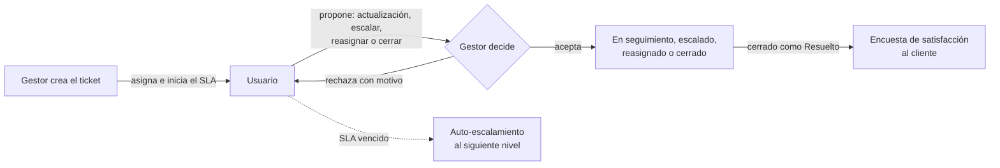
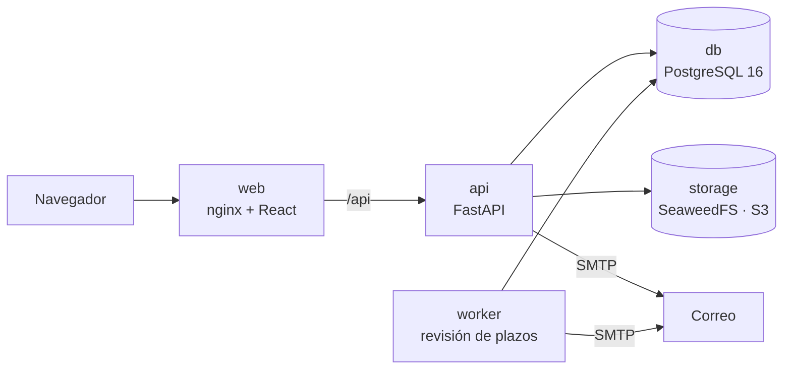

<div align="center">


# OpenDesk

**Mesa de ayuda open source para equipos de atención a clientes.**

Asigna cada solicitud a una persona, mide su tiempo de respuesta, aprueba cada avance y conoce la
satisfacción de tus clientes, sin suscripciones y en tu propia infraestructura.


[Funcionalidades](#funcionalidades) ·
[Inicio rápido](#inicio-rápido) ·
[Configuración](#configuración) ·
[Arquitectura](#arquitectura) ·
[Hoja de ruta](#hoja-de-ruta) ·
[Contribuir](#contribuir)

</div>

---

## ¿Por qué OpenDesk?

Muchas organizaciones pagan suscripciones costosas por plataformas de tickets que, en esencia, resuelven unas
pocas cosas: roles, un registro de solicitudes, tiempos de respuesta comprometidos y avisos. Otras siguen
operando con hojas de cálculo y reportes armados a mano.

OpenDesk cubre ese flujo completo con una interfaz pensada para usarse todo el día:
**pocas pantallas, pocos campos y una acción principal por vista**.

- **Cada avance se aprueba.** El responsable propone y el Gestor decide; nada cambia de estado sin una decisión registrada.
- **El SLA se respeta solo.** Los plazos consideran el horario de cada área y los días festivos; si alguien no responde a tiempo, el ticket sube de nivel automáticamente.
- **Los datos son tuyos.** Se despliega con Docker en tu servidor, con su base de datos y su almacenamiento de archivos.

## Cómo funciona



## Funcionalidades

### Tickets y flujo de aprobación
- Alta en un solo formulario con folio visible (`OD-000123`), prioridad y datos del cliente.
- El Usuario propone una **actualización con fecha compromiso**, **escalar**, **reasignar** (a un compañero o a otra área) o **cerrar**; el Gestor acepta o rechaza con comentario.
- El Gestor puede reasignar, cerrar y reabrir en cualquier momento.
- Estatus de seguimiento configurables, como "Esperando al cliente" o "Con proveedor".
- Adjuntos (imágenes y PDF) e historial completo de cada ticket.

### SLA y escalamiento
- Cada área define su tiempo de primera respuesta, su horario por día de la semana (o 24/7) y si pausa en días festivos.
- Matriz de escalamiento por niveles, editable arrastrando a las personas entre niveles.
- Al escalar, el ticket va a la persona del siguiente nivel con menos carga. Si no hay un nivel superior, el ticket se marca para intervención del Gestor.
- Semáforo y cronómetro del plazo vigente en cada vista.

### Avisos
- Campana de avisos en la aplicación y correo por SMTP para cada acción relevante.
- Un proceso en segundo plano revisa cada minuto los plazos:
  - aviso al 80 % del SLA;
  - auto-escalamiento al vencer;
  - recordatorio antes de la fecha compromiso;
  - alerta de compromiso vencido.

### Satisfacción del cliente
- Encuesta CSAT de 1 a 5 que se envía al cerrar un ticket como Resuelto. El cliente responde con un clic, sin crear una cuenta.
- La calificación y el comentario quedan visibles en el ticket.

### Analítica
Seis tableros, cada uno para una pregunta de negocio:

| Tablero | Responde |
|---|---|
| Resumen | ¿Cómo vamos hoy? |
| Tiempos y SLA | ¿Cumplimos lo que prometemos? |
| Equipo | ¿Cómo está repartido el trabajo y quién necesita apoyo? |
| Flujo | ¿Dónde se atora el proceso? |
| Clientes | ¿Qué tan satisfechos están y quién nos busca más? |
| Demanda | ¿Cuándo llegan las solicitudes, para planear turnos? |

Incluyen filtros por fechas, área y prioridad, comparación contra el periodo anterior y exportación a CSV. Cada
Usuario tiene además una vista con sus propios indicadores. La definición de cada métrica está en
[`docs/requisitos/07-analitica.md`](docs/requisitos/07-analitica.md).

### Roles

| Rol | Puede |
|---|---|
| **Administrador** | Todo lo del Gestor, además de administrar a otros Administradores. |
| **Gestor** | Crear y asignar tickets, decidir propuestas, administrar usuarios, áreas, horarios, festivos y estatus. |
| **Usuario** | Atender sus tickets asignados, proponer avances y consultar su desempeño. |

El acceso es con la cuenta de Google de cada persona; OpenDesk no guarda contraseñas.

## Inicio rápido

**Requisitos:** Docker con Compose, un cliente OAuth de Google y una cuenta de correo SMTP.

```bash
git clone https://github.com/DatzinDev/OpenDesk.git
cd OpenDesk
cp .env.example .env    # completa las variables
docker compose up -d --build
```

Abre `http://localhost:8080`.

- La cuenta definida en `ADMIN_EMAIL` es el Administrador principal y puede dar de alta al resto del equipo.
- En el cliente OAuth de Google, registra como URI de redirección `{APP_URL}/api/auth/callback`.
- Con `DEV_SEED=true` se cargan áreas, personas y unos 440 tickets ficticios, para explorar todas las vistas desde el primer momento.

## Configuración

Toda la configuración técnica vive en `.env`; ninguna credencial se muestra en la interfaz.

| Variable | Descripción | Por defecto |
|---|---|---|
| `APP_URL` | URL pública de la aplicación; base de los enlaces en correos | `http://localhost:8080` |
| `SECRET_KEY` | Valor aleatorio para firmar el flujo de inicio de sesión | — |
| `POSTGRES_PASSWORD` | Contraseña de la base de datos | — |
| `GOOGLE_CLIENT_ID`, `GOOGLE_CLIENT_SECRET` | Credenciales del cliente OAuth de Google | — |
| `ADMIN_EMAIL` | Correo del Administrador principal | — |
| `MAIL_HOST`, `MAIL_PORT`, `MAIL_USERNAME`, `MAIL_PASSWORD`, `MAIL_USE_TLS` | Servidor SMTP | puerto `587`, TLS activo |
| `MAIL_FROM`, `MAIL_FROM_NAME` | Remitente de los correos | — |
| `S3_ACCESS_KEY`, `S3_SECRET_KEY`, `S3_BUCKET` | Credenciales del almacenamiento de adjuntos | bucket `opendesk` |
| `APP_TIMEZONE` | Zona horaria para plazos, avisos y analítica | `America/Mexico_City` |
| `REMINDER_HOURS` | Anticipación del recordatorio de fecha compromiso, en horas | `24` |
| `WEB_PORT` | Puerto local publicado en producción | `8087` |
| `DEV_SEED` | `true` carga los datos ficticios de [`api/seeds/dev.sql`](api/seeds/dev.sql) | `false` |

### Producción

`compose.prod.yml` compila la interfaz, la sirve con nginx y publica un único puerto en `127.0.0.1`, listo para
colocarse detrás de un proxy inverso o un túnel con TLS.

```bash
docker compose -f compose.prod.yml up -d --build
```

Respalda los volúmenes `db-data` (PostgreSQL) y `storage-data` (adjuntos).

## Arquitectura



OpenDesk es un **monolito modular** organizado por funcionalidad (*vertical slices*), tanto en el backend como
en el frontend:
- Cada módulo encapsula sus rutas, reglas de negocio, tablas y eventos.
- Los módulos se comunican solo por su API pública o por eventos.
- Las pruebas verifican esas reglas de dependencia.

```
api/app/modules/   identity · users · areas · tickets · notifications · surveys · analytics · audit
web/src/features/  auth · users · areas · tickets · notifications · surveys · analytics
```

**Backend:** Python 3.12, FastAPI, SQLAlchemy 2, Alembic, PostgreSQL 16, Authlib, boto3.
**Frontend:** React 18, TypeScript, Vite, Mantine 7, TanStack Query.

El detalle de la estructura, las reglas de dependencia y cómo escalar está en
[`docs/arquitectura.md`](docs/arquitectura.md).

## Hoja de ruta

- [x] **0.1.0**: acceso y roles, áreas y SLA, matriz de escalamiento, tickets, avisos, encuesta y analítica.
- [ ] Pantalla de auditoría para el Administrador.
- [ ] Parámetros globales editables: nombre de la organización, anticipación del recordatorio, umbral de aviso del SLA, texto de la encuesta, dominio permitido y zona horaria.
- [ ] Avisos inmediatos en la aplicación, sin esperar la actualización periódica.
- [ ] Tiempos de la analítica en horas hábiles.

Los requisitos de cada módulo están en [`docs/requisitos`](docs/requisitos/README.md) y el historial de cambios en
[`CHANGELOG.md`](CHANGELOG.md).

## Desarrollo

```bash
docker compose up -d --build                        # entorno con recarga automática en :8080
docker compose exec api pytest -q                   # pruebas del backend
docker compose exec web npx tsc --noEmit -p .       # tipos del frontend
docker compose exec web npx eslint src              # reglas de dependencia del frontend
```

En desarrollo, `DEV_SEED=true` es el valor por defecto. La carga es idempotente: solo agrega tickets si no hay ninguno.

## Contribuir

Las contribuciones son bienvenidas. Consulta la [guía de contribución](CONTRIBUTING.md) antes de abrir un
*pull request*. Para reportar una vulnerabilidad, escribe a **contacto@datzin.com.mx** en lugar de abrir un
*issue* público.

## Documentación

| Documento | Contenido |
|---|---|
| [Requisitos](docs/requisitos/README.md) | Alcance y reglas de cada módulo |
| [Arquitectura](docs/arquitectura.md) | Stack, estructura y reglas de dependencia |
| [Diseño](docs/diseno.md) | Lineamientos de interfaz y marca |
| [Bitácora](docs/bitacora.md) | Historial de entregas y decisiones |
| [Cambios](CHANGELOG.md) | Registro de cambios por versión |

## Licencia

OpenDesk se distribuye bajo la [GNU Affero General Public License v3.0](LICENSE). Puedes usarlo, modificarlo y
desplegarlo libremente. Si ofreces una versión modificada como servicio a través de la red, debes poner su
código fuente a disposición de sus usuarios bajo la misma licencia.

---

<div align="center">

Software de la familia **[Datzin](https://datzin.com.mx)**, hecho en Guadalajara.

</div>
