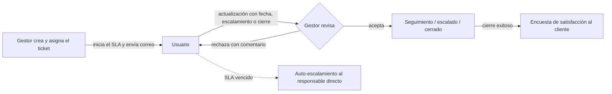

<div align="center">


# OpenDesk

**Gestión de tickets para atención a clientes, sin suscripciones ni formularios interminables.**

Asigna cada solicitud a una persona, mide su tiempo de respuesta y aprueba cada avance.
Todo en una sola plataforma open source que puedes desplegar en tu propia infraestructura.

[Requisitos](docs/requisitos/README.md) ·
[Arquitectura](docs/arquitectura.md) ·
[Diseño](docs/diseno.md) ·
[Bitácora](docs/bitacora.md)


</div>

---

## ¿Por qué OpenDesk?

Muchas organizaciones pagan suscripciones costosas por plataformas de tickets que, en esencia, resuelven
cuatro cosas: usuarios con roles, un registro de incidencias, asignaciones con tiempos de respuesta y
notificaciones. Otras siguen operando con hojas de cálculo y reportes manuales.

OpenDesk cubre exactamente ese flujo, con una interfaz pensada para usarse todo el día:
**pocas pantallas, pocos campos y una acción principal por vista**.

## Cómo funciona



## Funcionalidades

| Módulo | Descripción | Estado |
|---|---|:-:|
| Acceso y usuarios | Inicio de sesión con Google, roles Admin / Gestor / Usuario, auditoría y correos de cuenta | ✅ |
| Áreas y SLA | Tiempo de primera respuesta y horario de atención por área | 🔜 |
| Matriz de responsables | Responsable directo por usuario para escalamientos | 🔜 |
| Tickets | Formulario breve, propuestas del usuario y aprobación del gestor | 🔜 |
| Notificaciones | Avisos en la aplicación y por correo, recordatorios de fechas compromiso | 🔜 |
| Encuesta | Calificación del cliente con un solo clic desde el correo | 🔜 |
| Analítica | KPIs, tendencias y cumplimiento de SLA en tiempo real | 🔜 |

### Roles

| Rol | Para quién |
|---|---|
| **Administrador** | Responsable técnico: accesos, parámetros globales y auditoría. |
| **Gestor** | Opera el día a día: crea y asigna tickets, aprueba acciones y administra usuarios y áreas. |
| **Usuario** | Atiende los tickets asignados y reporta avances. |

## Inicio rápido

**Requisitos:** Docker con Compose, un cliente OAuth de Google y una cuenta SMTP.

```bash
git clone git@github.com:DatzinDev/OpenDesk.git
cd OpenDesk
cp .env.example .env    # completa las variables
docker compose up -d --build
```

En el cliente OAuth de Google registra como URI de redirección `{APP_URL}/api/auth/callback`.
La cuenta definida en `ADMIN_EMAIL` es el Administrador principal y puede dar de alta al resto del equipo.

### Configuración

| Variable | Descripción |
|---|---|
| `APP_URL` | URL pública de la aplicación |
| `SECRET_KEY` | Valor aleatorio para firmar el flujo de inicio de sesión |
| `POSTGRES_PASSWORD` | Contraseña de la base de datos |
| `GOOGLE_CLIENT_ID` / `GOOGLE_CLIENT_SECRET` | Credenciales del cliente OAuth de Google |
| `MAIL_HOST`, `MAIL_PORT`, `MAIL_USERNAME`, `MAIL_PASSWORD`, `MAIL_USE_TLS` | Servidor SMTP |
| `MAIL_FROM` / `MAIL_FROM_NAME` | Remitente de los correos |
| `ADMIN_EMAIL` | Correo del Administrador principal |

### Producción

`compose.prod.yml` compila la interfaz, la sirve con nginx y publica un único puerto en `127.0.0.1`,
listo para colocarse detrás de un proxy inverso o un túnel con TLS.

```bash
WEB_PORT=8087 docker compose -f compose.prod.yml up -d --build
```

## Stack

**Backend:** Python 3.12, FastAPI, SQLAlchemy 2, Alembic, PostgreSQL 16, Authlib.
**Frontend:** React 18, TypeScript, Vite, Mantine, TanStack Query.

El proyecto es un **monolito modular** organizado por funcionalidad (*vertical slices*), en el backend y
en el frontend. Cada módulo encapsula sus rutas, reglas de negocio, datos y eventos, y las reglas de
dependencia entre módulos se verifican automáticamente. Así, cualquier módulo puede extraerse más
adelante como servicio independiente. El detalle está en [docs/arquitectura.md](docs/arquitectura.md).

```
api/app/modules/   identity · users · audit · notifications · …
web/src/features/  auth · users · home · …
```

## Desarrollo

```bash
docker compose up -d --build          # entorno con recarga automática
docker compose exec api pytest -q     # pruebas del backend
```

Las convenciones de commits, el flujo de trabajo y el historial de decisiones están en la
[bitácora](docs/bitacora.md).

## Contribuir

Las contribuciones son bienvenidas. Abre un *issue* para describir el problema o la mejora antes de
enviar un *pull request*, y mantén cada cambio enfocado en un solo módulo.

---

<div align="center">

Software de la familia **[Datzin](https://datzin.com.mx)**, hecho en Guadalajara.

</div>
