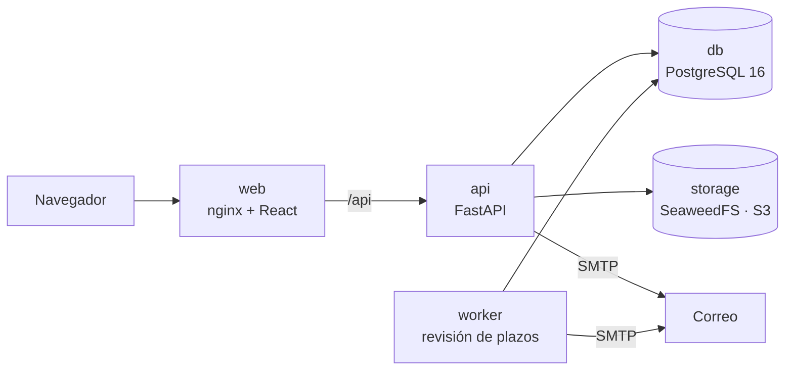

# Instalación y operación

Guía técnica para desplegar OpenDesk. Para conocer el producto, consulta el [README](../README.md).

## Requisitos
- Docker con Compose.
- Un cliente OAuth de Google (el inicio de sesión es con Google).
- Una cuenta de correo SMTP para los avisos y la encuesta.

## Inicio rápido

```bash
git clone https://github.com/DatzinDev/OpenDesk.git
cd OpenDesk
cp .env.example .env    # completa las variables
docker compose up -d --build
```

Abre `http://localhost:8080`.

- La cuenta definida en `ADMIN_EMAIL` es el Administrador principal y puede dar de alta al resto del equipo.
- En el cliente OAuth de Google, registra como URI de redirección `{APP_URL}/api/auth/callback`.
- Con `DEV_SEED=true` se cargan áreas, personas y unos 440 tickets ficticios para explorar todas las vistas.

## Configuración

Toda la configuración técnica vive en `.env`; ninguna credencial se muestra en la interfaz.

| Variable | Descripción | Por defecto |
|---|---|---|
| `APP_URL` | URL pública de la aplicación; base de los enlaces en correos | `http://localhost:8080` |
| `SECRET_KEY` | Valor aleatorio para firmar el flujo de inicio de sesión | — |
| `POSTGRES_PASSWORD` | Contraseña de la base de datos | — |
| `GOOGLE_CLIENT_ID`, `GOOGLE_CLIENT_SECRET` | Credenciales del cliente OAuth de Google | — |
| `ADMIN_EMAIL` | Correo del Administrador principal | — |
| `MAIL_HOST`, `MAIL_PORT`, `MAIL_USERNAME`, `MAIL_PASSWORD`, `MAIL_USE_TLS` | Servidor SMTP | puerto `587`, TLS activo |
| `MAIL_FROM`, `MAIL_FROM_NAME` | Remitente de los correos | — |
| `S3_ACCESS_KEY`, `S3_SECRET_KEY`, `S3_BUCKET` | Credenciales del almacenamiento de adjuntos | bucket `opendesk` |
| `APP_TIMEZONE` | Zona horaria para plazos, avisos y analítica | `America/Mexico_City` |
| `REMINDER_HOURS` | Anticipación del recordatorio de fecha compromiso, en horas | `24` |
| `WEB_PORT` | Puerto local publicado en producción | `8087` |
| `DEV_SEED` | `true` carga los datos ficticios de [`api/seeds/dev.sql`](../api/seeds/dev.sql) | `false` |

## Producción

`compose.prod.yml` compila la interfaz, la sirve con nginx y publica un único puerto en `127.0.0.1`, listo para
colocarse detrás de un proxy inverso o un túnel con TLS.

```bash
docker compose -f compose.prod.yml up -d --build
```

Respalda los volúmenes `db-data` (PostgreSQL) y `storage-data` (adjuntos).

## Servicios



| Servicio | Función |
|---|---|
| `web` | Interfaz (React) servida por nginx; redirige `/api` al servicio `api`. |
| `api` | API (FastAPI); aplica las migraciones al iniciar. |
| `worker` | Revisa los plazos cada minuto: avisos de SLA, auto-escalamiento y recordatorios. |
| `db` | PostgreSQL 16. |
| `storage` | SeaweedFS con API compatible con S3 para los adjuntos; sin puertos publicados. |

**Backend:** Python 3.12, FastAPI, SQLAlchemy 2, Alembic, PostgreSQL 16, Authlib, boto3.
**Frontend:** React 18, TypeScript, Vite, Mantine 7, TanStack Query.

La estructura modular, las reglas de dependencia y cómo escalar están en [arquitectura](arquitectura.md).

## Desarrollo

```bash
docker compose up -d --build                        # entorno con recarga automática en :8080
docker compose exec api pytest -q                   # pruebas del backend
docker compose exec web npx tsc --noEmit -p .       # tipos del frontend
docker compose exec web npx eslint src              # reglas de dependencia del frontend
```

En desarrollo, `DEV_SEED=true` es el valor por defecto. La carga es idempotente: solo agrega tickets si no hay
ninguno. Para contribuir, consulta la [guía de contribución](../CONTRIBUTING.md).
